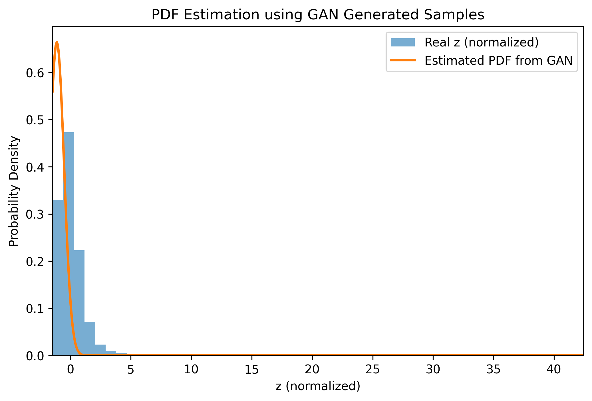

# Title: Learning Probability Density Functions using Data Only

---

## 1. Methodology

Data Collection → Data Pre-processing → Non-Linear Transformation →  
GAN Training → Sample Generation → PDF Approximation → Result Analysis

---

## 2. Dataset Information

- Dataset Name: India Air Quality Dataset  
- Source: Kaggle  
- Dataset Link: https://www.kaggle.com/datasets/shrutibhargava94/india-air-quality-data  
- Feature Used: NO2 concentration  

The dataset contains air quality measurements collected across multiple Indian cities. The NO2 feature is selected as the input variable for learning the probability density function.

---

## 3. Objective

The objective of this assignment is to learn an unknown probability density function of a transformed random variable using only data samples. No analytical or parametric form of the probability density function is assumed. A Generative Adversarial Network (GAN) is used to implicitly learn the distribution.

---

## 4. Mathematical Formulation

### Non-Linear Transformation

Each NO2 value x is transformed into z using the roll-number-parameterized non-linear function:

z = x + ar x sin(br * x)

where  
ar = 0.5 × (r mod 7)  
br = 0.3 × (r mod 5 + 1)  

and r is the university roll number.

---

### Transformation Parameters

For the given university roll number:

- ar = 0 
- br = 0.8999  

---

### GAN-Based Density Learning

- Real samples: z  
- Fake samples: z_f = G(epsilon), where epsilon ~ N(0,1)  
- The generator implicitly models the probability distribution of z  
- No parametric probability density function is assumed  

---

## 5. GAN Architecture Description

### Generator Network
- Fully connected neural network
- Input: One-dimensional noise sampled from a standard normal distribution
- Output: Generated samples of the transformed variable z

### Discriminator Network
- Fully connected neural network
- Input: Real or generated samples
- Output: Probability of the input sample being real

The generator and discriminator are trained adversarially until the generator produces samples that resemble the real transformed data.

---

## 6. PDF Approximation from Generator Samples

After training the GAN:
1. A large number of samples are generated using the generator
2. Kernel Density Estimation (KDE) is applied to the generated samples
3. The estimated density represents the learned probability density function of z

---

## 7. Input / Output

### Input
- NO2 concentration values from the air quality dataset

### Output
- Transformed variable z  
- Generated samples from the GAN  
- Estimated probability density function p(z)  

---

## 8. Result Graph

The figure below shows:
- Histogram of real transformed samples (z)
- KDE-based probability density function estimated from GAN-generated samples

### PDF Estimation Plot

---

## 9. Observations

### Mode Coverage
The generator captures the dominant mode of the transformed variable.

### Training Stability
Training remains stable due to normalization of data and the use of a simple GAN architecture.

### Quality of Generated Distribution
The estimated probability density function closely follows the empirical distribution of the real samples, with minor deviations in the tails.

---

## 10. Conclusion

This assignment demonstrates that Generative Adversarial Networks can be used to learn an unknown probability density function directly from data samples. The approach avoids assuming any analytical form of the distribution and provides a purely data-driven solution for density estimation.

---

## 11. Tools & Technologies Used

- Google Colab  
- Python  
- NumPy  
- Pandas  
- TensorFlow / Keras  
- Matplotlib  
- Scikit-learn  

---

## 12. Repository Structure

Probability-Density-Functions-using-data-only 
│── Assignment-4(Probability Density Function using data only).ipynb 
│── image.png  
│── README.md  

---

## 13. Execution Platform

- Google Colab  
- GitHub  

